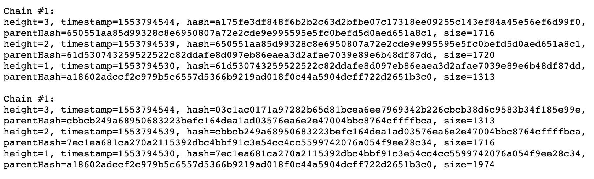

# cs686 - Project 4: Build a simple PoW

### Background
- Now that you can communicate the newest blocks with each other, you now need to agree on the latest block to agree on ONE canonical blockchain among all peers. Implement a simple PoW or any other consensus algorithm to maintain one canonical blockchain among the peers.
- One option is to implement Nakamoto Consensus. If you want to implement other consensus algorithms, you must talk to Professor EJ before implementing it.

### Simple Proof of Work
- Bitcion and Ethereum adjusts the difficulty of the hash puzzle based on the time elapsed between two blocks. If it is too short, then make the puzzle harder. If it is too long, then make the puzzle easier. For Project 4, you don't have to adjust the difficulty (thus called Simple PoW).

- Use SHA-3 as the hash function. (You may use other cryptographic hash function. If you wish to, send a message to Instructors on Piazza to get approval.) Instead of randomly selecting to produce a new block as you did in Project 3, your program needs to solve a hash puzzle before sending a new block to peers. Here is the default hash puzzle. You may change the number of 0's in your submission depending on your computer's speed. Ideally a new block will be created in every 10 seconds in average.

- Find x such that y starts with at least 10 0's, while y is defined as

  y = SHA-3(Hash of the parent block || x || root hash of MPT of the current block content) 

  where || is concatenation. Note that you will have to create an MPT of the block you wish to create before solving this puzzle.

- You will need to use multithreading to keep sending the heartbeats while solving this hash puzzle.

- The Block structure needs to be modified to include a new variable "nonce" that stores the value of x your program found.

- You need to modify ReceiveHeartBeat() to verify that the block's creator solved the hash puzzle. Specifically, when the received HeartBeat contains a block, calculate SHA-3(ParentHash || nonce || Hash) using the received block's content, and check if the output of SHA-3 function does start with at least 10 0's. If the verification fails, this block is not added to the blockchain. Otherwise, add this block to the blockchain and make sure that the parent block of this new block is stored in the blockchain too.

## Nakamoto Consensus

### Nakamoto consensus considers the longest chain (or the chain on which the most computing power spent) as the canonical chain. Assuming the greatest height of all blocks stored in all peers is 100,
- (1) If there's only one block at height 100, the chain of that block and all its predecessors (parent, parent of the parent, etc) is the canonical chain. 
- (2) If there are multiple blocks at height 100, they are considered as forks, and each fork can form a chain. The canonical chain would be decided once one of the forks grows and that chain becomes the longest chain.

### Functionalities

#### In file Block.go:
- Block.Header.Nonce: Add a field "Nonce" to Block.Header. Update BlockJson structure, EncodeToJson() and DecodeFromJson() functions accordingly. 

#### In file BlockChain.go:

- GetLatestBlocks(): This function returns the list of blocks of height "BlockChain.length".

- GetParentBlock(): This function takes a block as the parameter, and returns its parent block.

#### In file SyncBlockChain.go:

- The synchronized version of GetLatestBlocks() and GetParentBlock().

#### In file routes.go:

- Add a route: Name is "Canonical", Method is GET, Pattern is "/canonical", HandlerFunc is "Canonical".

#### In file handlers.go:

- AskForBlock(): Update this function to recursively ask for all the missing predesessor blocks instead of only the parent block. 

- StartTryingNonces(): This function starts a new thread that tries different nonces to generate new blocks. Nonce is a string of 16 hexes such as "1f7b169c846f218a". Initialize the rand when you start a new node with something unique about each node, such as the current time or the port number. Here's the workflow of generating blocks:

    * (1) Start a while loop. 
    * (2) Get the latest block or one of the latest blocks to use as a parent block. 
    * (3) Create an MPT.
    * (4) Randomly generate the first nonce, verify it with simple PoW algorithm to see if SHA3(parentHash + nonce + mptRootHash) starts with 10 0's (or the number you modified into). Since we use one laptop to try different nonces, six to seven 0's could be enough. If the nonce failed the verification, increment it by 1 and try the next nonce. 
    * (6) If a nonce is found and the next block is generated, forward that block to all peers with an HeartBeatData; 
    * (7) If someone else found a nonce first, and you received the new block through your function ReceiveHeartBeat(), stop trying nonce on the current block, continue to the while loop by jumping to the step(2).

- HeartBeatReceive(): Alter this function so that when it receives a HeartBeatData with a new block, it verifies the nonce as described above.

- Canonical(): This function prints the current canonical chain, and chains of all forks if there are forks. Note that all forks should end at the same height (otherwise there wouldn't be a fork).  
  Example of the output of Canonical() function: You can have a different format, but it should be clean and clear.

